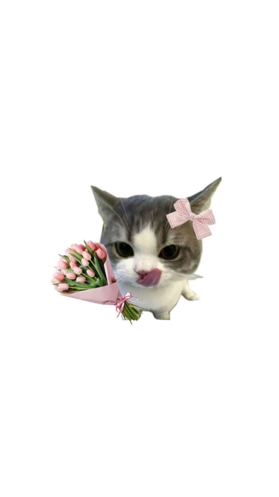

<!DOCTYPE html>
<html lang="vi">
<head>
<meta charset="UTF-8">
<meta name="viewport" content="width=device-width, initial-scale=1.0">

<title>Đi hẹn hò hok mom?</title>

<link href="https://fonts.googleapis.com/css2?family=Pacifico&family=Baloo+2:wght@400;700&display=swap" rel="stylesheet">

</head>

<body>

    

    

        ✨ Click vào đây để khám phá option nhé sốp! ✨
    

    <h1 id="text"></h1>

    

        <button id="yes">💗 Kó</button>
        <button id="no">🙈 Hok</button>
    

</body>
</html>
